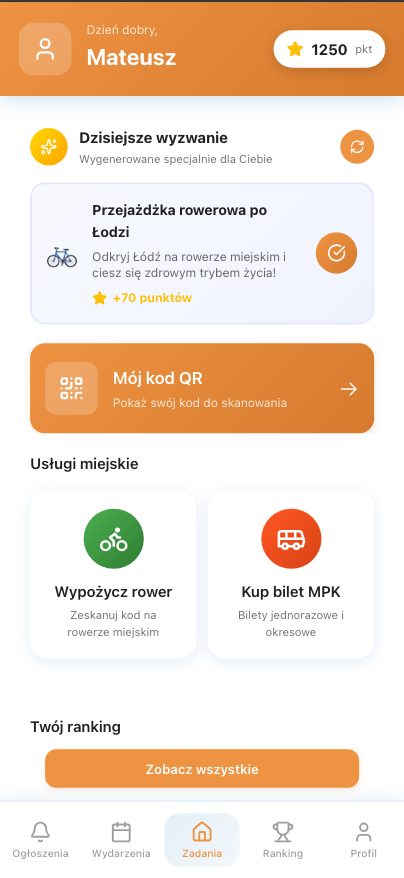
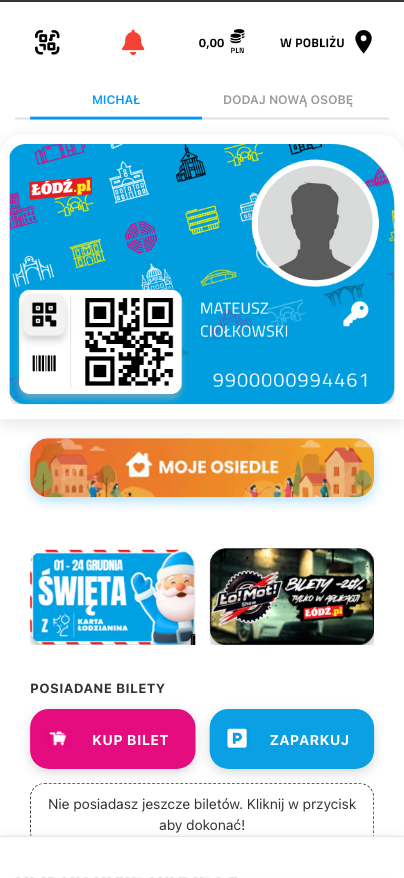

# 🏘️ Moje Osiedle

**Moduł do aplikacja karta łodzianina "MOJE OSIEDLE**

🏆 Projekt zajął pierwsze miejsce podczas **Hackathonu ŁÓDŹ_HACK**

---

## 🎯 O projekcie

**Moje Osiedle** to moduł do aplikacji Karta Łodzianina, która angażuje mieszkańców Łodzi do aktywnego uczestnictwa w życiu społecznym swojego osiedla.  
System premiuje punktami za ekologiczne wybory (jazda rowerem, komunikacja miejska), udział w wydarzeniach lokalnych oraz wypełnianie codziennych wyzwań generowanych przez AI.

Dzięki **rankingom osiedli**, mieszkańcy rywalizują` między sobą, tworząc zdrową konkurencję i budując społeczność lokalną.  
Celem projektu jest **wzmocnienie więzi sąsiedzkich** oraz promowanie zrównoważonego rozwoju poprzez grywalizację codziennych aktywności.

---

  

---

  

---

  

---

  

---

## 🚀 Kluczowe funkcje

- 🎮 **Gamifikacja zaangażowania** – zbieraj punkty za aktywność lokalną
- 🚴 **Ekologiczny transport** – nagrody za rowery i komunikację miejską
- 🤖 **AI-generowane wyzwania** – codzienne zadania dostosowane do użytkownika
- 📸 **Weryfikacja zdjęciowa** – potwierdź wykonanie zadania selfie
- 🏆 **Ranking osiedli** – rywalizacja między dzielnicami Łodzi
- 📅 **Wydarzenia lokalne** – odkryj co dzieje się w Twoim mieście
- 💳 **Cyfrowa Karta Łódzka** – identyfikator mieszkańca z QR kodem
- 🎯 **Wyzwania skanowania QR** – dodatkowe punkty za aktywności

## 🔧 Moduły systemu

### 🏠 Home Module

- Profil użytkownika z aktualną liczbą punktów
- Codzienne wyzwanie generowane przez AI
- Wybór środka transportu (rower/komunikacja miejska)
- System weryfikacji wykonanych zadań przez zdjęcie

### 🏆 Ranking Module

- Ranking osiedli w Łodzi (Widzew, Bałuty, Górna, Śródmieście...)
- Poziomy osiągnięć dla dzielnic
- System EXP i progresji
- Porównanie wyników między osiedlami

### 📅 Events Module

- Lista wydarzeń lokalnych w Łodzi
- Szczegóły wydarzeń z lokalizacją i datą
- Punkty za uczestnictwo w wydarzeniach
- Możliwość zapisania się na wydarzenie

### 💳 Profile Module

- Cyfrowa Karta Łódzka z QR kodem
- Numer karty użytkownika
- Historia zdobytych punktów
- Ustawienia profilu

### 🎯 Challenge Module

- Generowanie spersonalizowanych wyzwań
- Skanowanie QR kodów
- Weryfikacja wykonania zadań
- System nagród punktowych

---

## 🛠️ Technologie

### Frontend

- **React 19 + Vite** – nowoczesny framework UI
- **TypeScript** – typowanie statyczne
- **React Router** – routing aplikacji
- **Lucide Icons** – biblioteka ikon
- **HTML5 QR Code** – skanowanie kodów QR
- **OpenAI API** – generowanie zadań AI

---

## 📊 System punktów

Punkty są przypisywane do osiedla użytkownika, co wpływa na pozycję w rankingu ogólnomiejskim.

---

## 📈 Funkcje biznesowe

### Dla mieszkańców:

- 🎮 **Gamifikacja życia codziennego** – motywacja do aktywności
- 🏆 **Rywalizacja osiedlowa** – zdrowa konkurencja między dzielnicami
- 🌱 **Ekologiczne wybory** – nagrody za zrównoważony transport
- 📅 **Życie lokalne** – dostęp do wydarzeń w okolicy
- 💳 **Cyfrowa legitymacja** – wygodna identyfikacja mieszkańca

### Dla miasta Łódź:

- 📊 **Dane o mobilności** – analiza wyboru środków transportu
- 🤝 **Zaangażowanie społeczne** – większa frekwencja na wydarzeniach
- ♻️ **Zmniejszenie emisji** – promocja transportu publicznego i rowerów
- 🏘️ **Wzmocnienie tożsamości osiedli** – budowanie społeczności lokalnych

---

## 🏆 Osiągnięcia

> 🏅 Projekt **Moje Osiedle** został stworzony podczas hackathonu organizowanego przez Miasto Łódź, promującego innowacyjne rozwiązania dla życia miejskiego.

---

## 👥 Zespół

**Moje Osiedle Team**  
Mateusz Ciołkowski  
Kacper Kleczaj  
Piotr Gliszczyński  
Szymon Kaźmierczak  
Aleksander Kaźmierczak  

---

## 🚀 Kierunki rozwoju

- 🤖 **Zaawansowane AI** – personalizacja wyzwań na podstawie historii użytkownika
- 📱 **Aplikacja natywna** – wersja mobilna na iOS i Android
- 🏪 **Sklep nagród** – wymiana punktów na lokalne benefity
- 🗺️ **Mapa osiedla** – interaktywna mapa z punktami zainteresowania
- 👥 **Profile społecznościowe** – follow sąsiadów i zespoły osiedlowe
- 📊 **Dashboard dla miasta** – analityka dla urzędników
- 🎁 **Partnerstwa lokalne** – współpraca z lokalnymi biznesami
- ♻️ **Więcej kategorii eko** – segregacja śmieci, oszczędzanie wody
